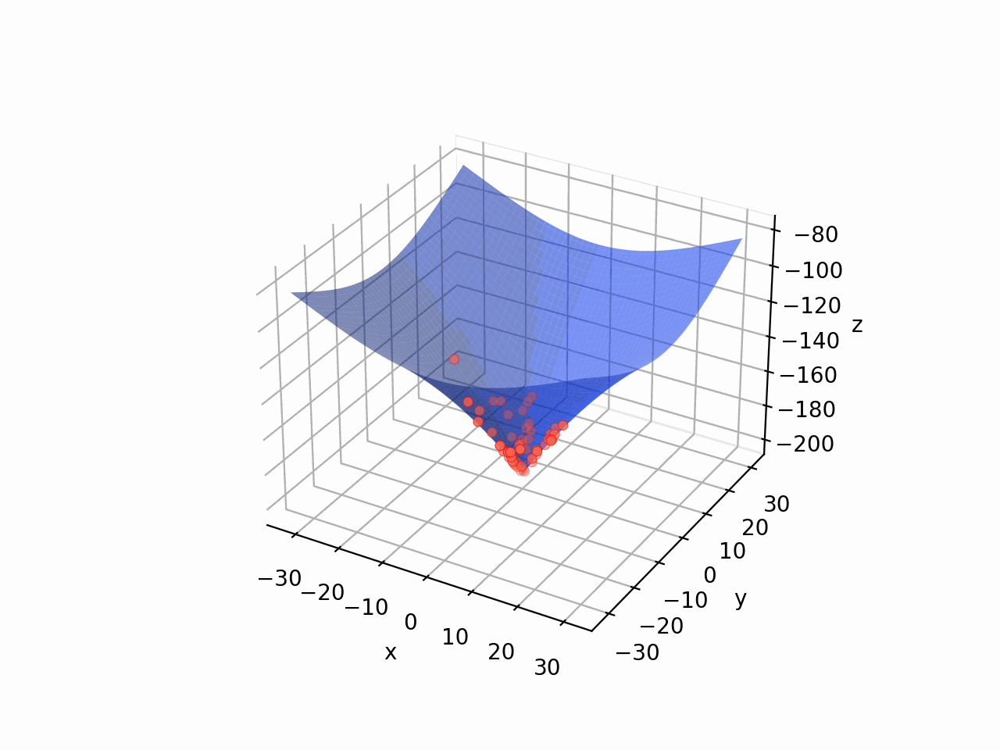

# MH_Animetionについて

DEやPSOなどの，母集団ベースのメタヒューリスティクスが連続関数をどのように最適化しているのかをアニメーションで見ることができる．




## 使用ライブラリ
[mealpy](https://github.com/thieu1995/mealpy)<br>
[opfunu](https://github.com/thieu1995/opfunu)


## 使い方

１．main.pyを実行する
```
> python3 main.py
```
２．最適化する関数を選択する
```
select function [1.Ackley,2.Alpine,3.EggCrate,4.EggHolder,]:
```
３．使用するメタヒューリスティクスを選択する
```
select model [1.DE,2.PSO,3.ABC,4.FFA]:       
```
４．アニメーションの次元を2次元か3次元か選択する
```
input animation dimention [2 or 3]:
```
